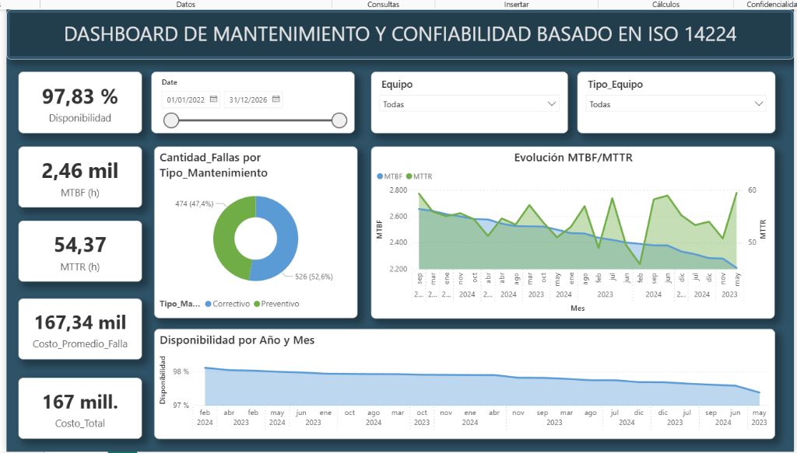

<h1 align="center">Dashboard de Gestión de Mantenimiento bajo ISO 14224</h1>

  

  Este proyecto documenta un ejercicio práctico de diseño e implementación de un sistema de inteligencia de negocios aplicado a la gestión de activos, utilizando <strong>Power BI</strong> como herramienta de explotación y la norma <strong>ISO 14224</strong> como marco conceptual.

  El propósito principal no es solo la visualización de datos, sino la estructuración correcta de la información de mantenimiento para habilitar análisis de confiabilidad robustos y toma de decisiones fundamentada.

<h2>Contexto y Metodología: La Importancia de ISO 14224</h2>

  En la gestión de mantenimiento, uno de los desafíos más comunes es la calidad del dato. Registros inconsistentes o subjetivos hacen imposible el cálculo fiable de indicadores. Para mitigar esto, este proyecto adopta los lineamientos de la norma internacional <strong>ISO 14224</strong> para la recolección e intercambio de datos de confiabilidad.

  La aplicación de esta norma en el modelo de datos permitió:

<ul>
  <li><strong>Estandarización de Eventos</strong>: Clasificación clara entre fallas funcionales y suspensiones.</li>
  <li><strong>Taxonomía de Modos de Falla</strong>: Uso de un catálogo predefinido de causas y modos de falla, evitando la ambigüedad del texto libre.</li>
  <li><strong>Cálculos Temporales Precisos</strong>: Segregación estricta entre tiempos de operación (Uptime) y tiempos de indisponibilidad (Downtime).</li>
</ul>

<h2>Ingeniería de Datos y Cálculos DAX</h2>

  El núcleo del dashboard reside en su capa semántica. A continuación, se detalla la metodología de cálculo para cada indicador, asegurando la trazabilidad y transparencia del análisis.

<h3>1. Confiabilidad: MTBF (Mean Time Between Failures)</h3>

Representa el tiempo promedio que un activo opera exitosamente entre paradas no planificadas.

<ul>
  <li><strong>Fórmula DAX</strong>:
    <pre lang="dax">
MTBF = DIVIDE(
    SUM('dataset'[Tiempo_Operacion_h]),
    [Cantidad_Fallas],
    BLANK()
)
    </pre>
  </li>
  <li><strong>Lógica Técnica</strong>: Se utiliza <code>DIVIDE</code> con manejo de nulos (<code>BLANK()</code>) para evitar errores matemáticos en periodos sin fallas. Es crucial notar que el numerador considera estrictamente el <em>Tiempo de Operación</em>, excluyendo tiempos de parada por mantenimiento preventivo o stand-by, cumpliendo con la definición estricta de ISO 14224.</li>
  <li><strong>Importancia</strong>: Un MTBF creciente valida la efectividad de las mejoras de ingeniería y la calidad de los materiales.</li>
</ul>

<h3>2. Mantenibilidad: MTTR (Mean Time To Repair)</h3>

Mide la eficiencia organizacional para restaurar la función del activo tras una falla.

<ul>
  <li><strong>Fórmula DAX</strong>:
    <pre lang="dax">
MTTR = DIVIDE(
    SUM('dataset'[Tiempo_Reparacion_h]),
    [Cantidad_Fallas]
)
    </pre>
  </li>
  <li><strong>Lógica Técnica</strong>: El cálculo agrupa todos los tiempos asociados a la reparación (diagnóstico, espera de repuestos, intervención activa).</li>
  <li><strong>Visualización</strong>: Dado que la magnitud del MTBF (miles de horas) difiere drásticamente del MTTR (decenas de horas), se implementó un gráfico de evolución con <strong>doble eje Y</strong>. Esto permite correlacionar visualmente si un aumento en la frecuencia de fallas coincide con una degradación en los tiempos de respuesta.</li>
</ul>

<h3>3. Disponibilidad Técnica (Availability)</h3>

La probabilidad de que un equipo esté en estado operativo cuando se requiere.

<ul>
  <li><strong>Fórmula DAX (Robusta)</strong>:
    <pre lang="dax">
Disponibilidad = 
VAR Uptime = SUM('dataset'[Tiempo_Operacion_h])
VAR Downtime = SUM('dataset'[Tiempo_Reparacion_h])
VAR TotalTime = Uptime + Downtime
RETURN
    IF(TotalTime = 0, BLANK(), DIVIDE(Uptime, TotalTime))
    </pre>
  </li>
  <li><strong>Lógica Técnica</strong>: A diferencia de la fórmula teórica simplificada (MTBF / (MTBF + MTTR)), esta implementación basada en tiempos acumulados es más precisa para periodos agregados, ponderando correctamente el peso de cada evento.</li>
</ul>

<h3>4. Análisis de Tendencias (Media Móvil)</h3>

Para suavizar la variabilidad natural de los datos y detectar tendencias reales, se implementaron cálculos de media móvil de 30 días.

<ul>
  <li><strong>Fórmula DAX</strong>:
    <pre lang="dax">
MTBF_MA30 = 
CALCULATE(
    [MTBF],
    DATESINPERIOD('Calendario'[Date], LASTDATE('Calendario'[Date]), -30, DAY)
)
    </pre>
  </li>
  <li><strong>Interpretación</strong>: Permite eliminar el "ruido" de fallas puntuales y visualizar si la confiabilidad del sistema está mejorando o empeorando estructuralmente.</li>
</ul>

<h2>Análisis de Estrategia de Mantenimiento</h2>

  El dashboard incluye visualizaciones específicas para evaluar la madurez de la gestión:

<ul>
  <li><strong>Relación PM/CM (Preventivo vs Correctivo)</strong>: A través de un gráfico de anillo, se monitorea la proporción de órdenes de trabajo reactivas frente a las proactivas. Un predominio del segmento correctivo alerta sobre una gestión ineficiente de recursos.</li>
  <li><strong>Evolución Temporal</strong>: El análisis de tendencias permite identificar si las políticas de mantenimiento aplicadas están logrando estabilizar la operación a lo largo del tiempo.</li>
</ul>

<h2>Estructura del Proyecto</h2>
<ul>
  <li><code>Dashboard de Mantenimiento.pbix</code>: El archivo fuente con el modelo de datos y las visualizaciones.</li>
  <li><code>dataset.xlsx</code>: Conjunto de datos simulado y estructurado bajo los principios mencionados.</li>
  <li><code>maintenance_dashboard_theme.json</code>: Archivo de tema corporativo aplicado para garantizar consistencia visual y usabilidad.</li>
</ul>

<em>Ejercicio desarrollado con fines académicos y de portafolio profesional.</em>

